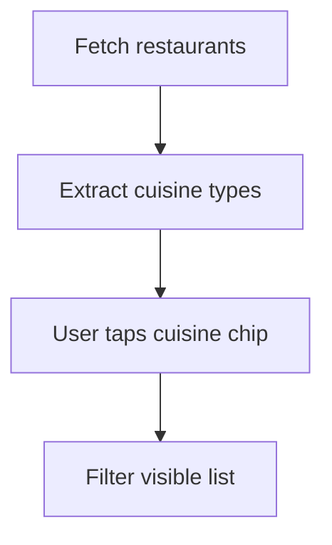

# Food Delivery Home App

## Overview

This project is a food delivery discovery screen built with React Native and Expo SDK 54. It fetches restaurants from a MySQL-backed API and allows users to filter the list by cuisine category using an intuitive mobile chip interface.

The app focuses on discoverability, lightweight filtering, and clear separation of responsibilities between the client, the API layer, and the database.

## Architecture


## Key Features

- Fetches restaurant records from a dedicated schema
- Displays cuisine and rating in a mobile-friendly card layout
- Filters restaurants by cuisine in the client layer
- Preserves full application isolation from the other projects
- Uses Expo host detection for easier local device testing

## Technology Stack

- React Native with Expo SDK 54
- Express.js
- mysql2
- MySQL via XAMPP

## API Contract

### `GET /restaurants`

Returns:

```json
[
  {
    "id": 1,
    "name": "Spice Route",
    "cuisine": "Pakistani",
    "rating": "4.8"
  }
]
```

## Database Design

Database: `assignment3_app5`

Table: `restaurants`

| Column | Type |
|---|---|
| id | INT, PK, AUTO_INCREMENT |
| name | VARCHAR(150) |
| cuisine | VARCHAR(80) |
| rating | DECIMAL(2,1) |

## Filter Flow



## Project Structure

```text
.
├── App.js
├── AppMain.js
├── server.js
├── sql2.sql
├── package.json
└── .gitignore
```

## Run Locally

1. Start MySQL in XAMPP.
2. Import [`sql2.sql`](./sql2.sql).
3. Run `npm install`
4. Run `node server.js`
5. Run `npx expo start -c`

Backend port: `4105`

## Engineering Notes

- The backend returns ranked restaurant data while the UI owns interactive filtering.
- This project demonstrates thoughtful UI state management without unnecessary backend complexity.
